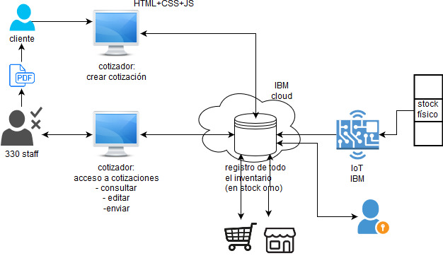

# 330 ohm

## Arquitectura de la solución

## Roadmap de seguridad

1. Analizar posibles amenazas
2. Determinar política de seguridad de la empresa
3. Escoger la solución de seguridad acorde a la política de seguridad
4. Desplegar solución
5. Probar, evaluar
6. Identificar y corregir problemas
7. Educación en ciberseguridad empleados, proveedores, clientes.
8. Realizar pruebas periódicas de seguridad, auditar, adaptar

## Resumen de la solución